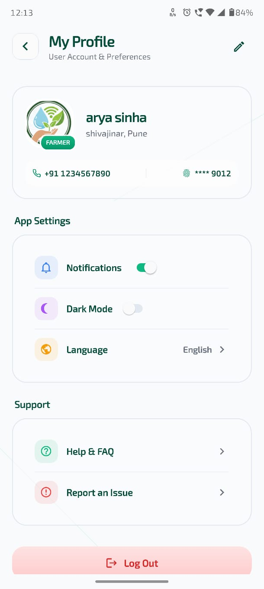
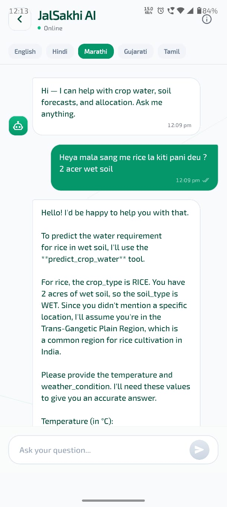
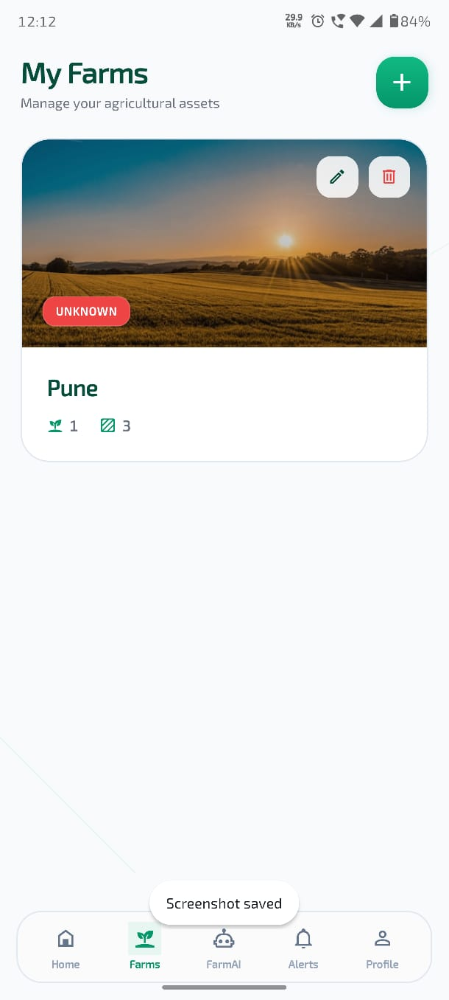
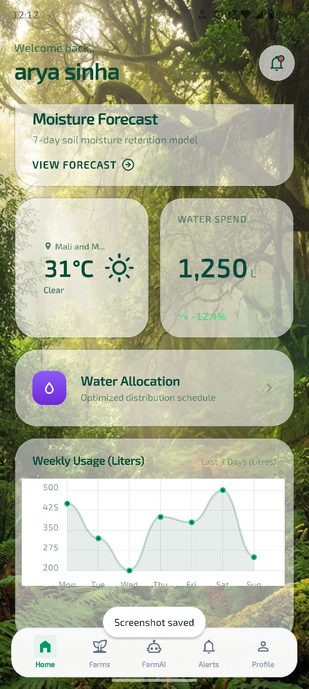
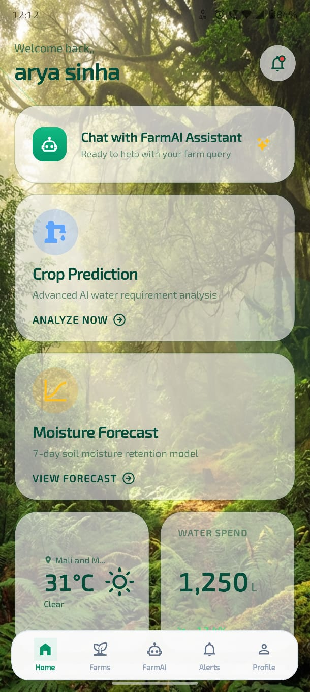
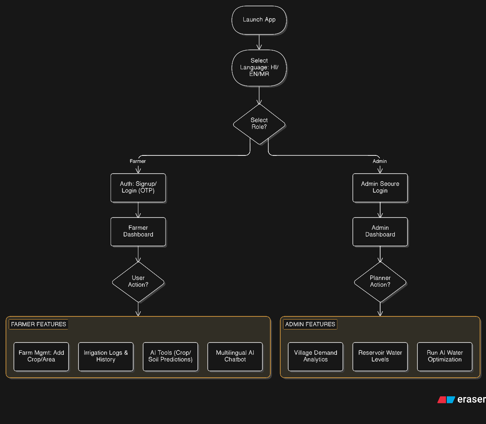
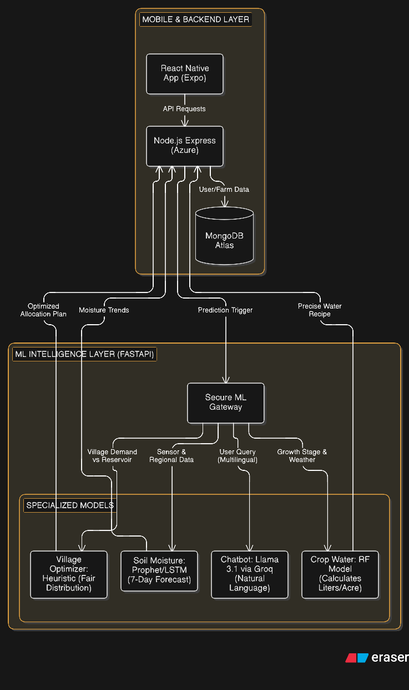
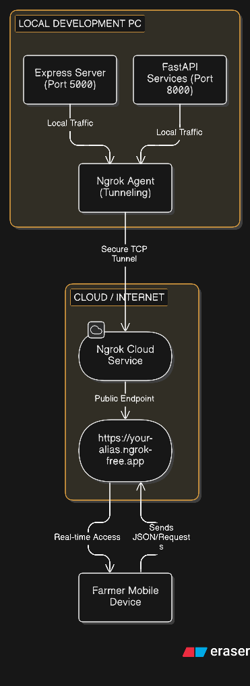

<div align="center">

<!-- Animated Header -->


# JalSakhi 🌾💧

### AI-Powered Precision Agriculture Platform

**Smart Water Management for Sustainable Farming in India**

<!-- Repository View Counter -->


<!-- Repository Visitors -->


</div>

---

<div align="center">

<!-- GitHub Stats Badges -->


<!-- Project Stats -->


<!-- Activity -->


<!-- Issues & PRs -->


<!-- Technology Badges -->
[](https://reactnative.dev/)
[](https://expo.dev/)
[](https://nodejs.org/)
[](https://python.org/)
[](https://fastapi.tiangolo.com/)
[](https://www.mongodb.com/)
[](LICENSE)

[Features](#-key-features) • [Demo](#-app-showcase) • [Quick Start](#-quick-start) • [Architecture](#️-architecture) • [Tech Stack](#-technology-stack) • [Documentation](#-documentation) • [Contributing](#-contributing) • [Stats](#-project-stats)

<!-- Typing SVG -->
<p align="center">
  
</p>

</div>

## 📖 About

**JalSakhi** (*Water Friend* in Hindi) is an AI-powered precision agriculture platform revolutionizing water management for Indian farmers. Built by 4 passionate developers, it combines ML models with an intuitive mobile interface to solve water scarcity challenges through:

🤖 **AI Predictions** • 📈 **7-Day Forecasts** • ⚖️ **Smart Allocation** • 🌍 **Multilingual (EN/HI/MR)** • 💬 **AI Chatbot**

---

## 🎨 App Showcase

<div align="center">

### Mobile Application








*Cross-platform mobile app built with React Native & Expo*

</div>

---

## 🚀 Key Features

<table>
<tr>
<td width="50%">

### 👨‍🌾 For Farmers

- 🌾 **Crop Management** - Track multiple farms and crops
- 💧 **Water Predictions** - AI-driven irrigation recommendations
- 📊 **Soil Monitoring** - 7-day moisture forecasts
- 📝 **Irrigation Logs** - Track water usage history
- 🌤️ **Weather Updates** - Real-time weather integration
- 📱 **Mobile-First** - Works on any device
- 🌍 **Multilingual** - Hindi, Marathi, English support
- 🤖 **AI Chatbot** - Ask questions, get instant answers

</td>
<td width="50%">

### 👔 For Administrators

- 🏘️ **Village Management** - Oversee entire communities
- ⚖️ **Water Allocation** - AI-optimized distribution
- 📈 **Analytics Dashboard** - Real-time insights
- 👥 **Farmer Registration** - Approve and manage users
- 🚨 **Anomaly Detection** - Identify unusual patterns
- 💾 **Reservoir Monitoring** - Track water levels
- 🎯 **Simulation Tools** - Plan allocation scenarios
- 📊 **Usage Reports** - Detailed analytics

</td>
</tr>
</table>

---

## 🏗️ Architecture

<div align="center">

### System Overview

```
┌──────────────────────────────────────────────────────────┐
│                    👥 End Users                          │
│         Farmers • Administrators • Planners              │
└────────────────────────┬─────────────────────────────────┘
                         │
                         ▼
┌──────────────────────────────────────────────────────────┐
│              📱 Mobile Application Layer                 │
│    React Native (Expo) • TypeScript • Expo Router        │
│    Farmer Dashboard • Admin Panel • ML Integration       │
└────────────────────────┬─────────────────────────────────┘
                         │
                         ▼
┌──────────────────────────────────────────────────────────┐
│              🖥️  Backend API Layer                       │
│    Node.js • Express • MongoDB Atlas • JWT Auth          │
│    REST APIs • Email OTP • Farm Management               │
└────────────────────────┬─────────────────────────────────┘
                         │
                         ▼
┌──────────────────────────────────────────────────────────┐
│              🛡️  ML Gateway (Security Layer)             │
│    API Key Auth • Rate Limiting • Request Validation     │
└────────────────────────┬─────────────────────────────────┘
                         │
            ┌────────────┼────────────┬────────────┐
            ▼            ▼            ▼            ▼
    ┌─────────────┬─────────────┬────────────┬─────────────┐
    │   Crop      │    Soil     │  Village   │     AI      │
    │   Water     │  Moisture   │   Water    │  Chatbot    │
    │ Prediction  │ Forecasting │ Allocation │   (Groq)    │
    │             │             │            │             │
    │  FastAPI    │   FastAPI   │  FastAPI   │  FastAPI    │
    │ RandomForest│ Prophet/LSTM│ Heuristic  │  Llama 3.1  │
    └─────────────┴─────────────┴────────────┴─────────────┘
```

**📚 Learn More:** [Architecture Documentation](docs/ARCHITECTURE.md)

</div>

---

## � System Flow Diagrams

<div align="center">

### User Flow & Navigation



*Complete user journey from app launch to feature access for both Farmer and Admin roles*

### ML Services Architecture



*Three-layer architecture showing Mobile/Backend Layer, ML Intelligence Layer (FastAPI), and Specialized Models*

### Local Development Setup (Ngrok)



*Development workflow using Ngrok for secure tunneling between local services and mobile devices*

**Key Flows:**
- 🔐 **Authentication**: OTP-based signup/login with role-based access control
- 🎯 **Feature Access**: Dedicated dashboards for Farmers (Farm Management, AI Tools, Chatbot) and Admins (Village Analytics, Water Optimization)
- 🤖 **ML Pipeline**: API requests flow through secure ML Gateway to specialized models (Soil Moisture, Crop Water, Village Optimization, Chatbot)
- 🔧 **Development**: Local services exposed via Ngrok for real-time mobile testing

</div>

---

## �💻 Technology Stack

<div align="center">

### Frontend


### Backend


### ML & AI


</div>

---

## 🚀 Quick Start

### Prerequisites

Ensure you have the following installed:

- **Node.js** 18+ ([Download](https://nodejs.org/))
- **Python** 3.10+ ([Download](https://python.org/))
- **MongoDB** Atlas account ([Sign up](https://www.mongodb.com/cloud/atlas))
- **Git** ([Download](https://git-scm.com/))

### One-Command Setup

```bash
# Clone repository
git clone https://github.com/Sameer-Bagul/jalsakhi-ai-powered-precision-agriculture-platform.git
cd jalsakhi-ai-powered-precision-agriculture-platform

# Run automated setup
chmod +x setup.sh
./setup.sh
```

The setup script will:
- ✅ Install all Node.js dependencies
- ✅ Install all Python dependencies
- ✅ Create environment file templates
- ✅ Check for required tools
- ✅ Provide next steps guidance

<details>
<summary><b>🔧 Manual Setup (Click to expand)</b></summary>

```bash
# App: cd app && npm install && npm start
# Server: cd server && npm install && npm start  
# ML: cd ml-services/models && pip install -r unified_api/requirements.txt && uvicorn unified_api.main:app --port 8000
# Gateway: cd ml-services/gateway && npm install && npm start
```
</details>

---

## 📂 Structure

```
📱 app/          Mobile (React Native + Expo)
🖥️  server/       Backend (Node.js + MongoDB)
🧠 ml-services/  ML Models (4 FastAPI services + Gateway)
📚 docs/         Documentation
🖼️  images/       Screenshots
```

---

## 📚 Documentation

[Architecture](docs/ARCHITECTURE.md) • [API Reference](docs/API.md) • [Development Guide](docs/DEVELOPMENT.md) • [Contributing](CONTRIBUTING.md) • [Code of Conduct](CODE_OF_CONDUCT.md)

---


## 🤝 Contributing

Fork → Create branch → Commit → Push → PR. Read [Contributing Guidelines](CONTRIBUTING.md) first.

**Help Wanted:** Tests, UI/UX, Performance, Docs, Bug Fixes, Features

---

## 🗺️ Roadmap

**v1.0 (Completed):** Mobile App • Backend API • 4 ML Models • Chatbot • Multilingual Support

---

##  Team & Contributors

A collaborative project by developers who love to code and solve real-world problems. 💻

### Core Team
- **[Sameer Bagul](https://github.com/Sameer-Bagul)** - Project Lead & Full Stack Developer

### Contributors Wall

<div align="center">

<!-- Contributors Widget -->
<a href="https://github.com/Sameer-Bagul/jalsakhi-ai-powered-precision-agriculture-platform/graphs/contributors">
  
</a>

**Thank you to all our amazing contributors!** 🎉

</div>

### Want to Join?

We're always looking for passionate developers! Check out our [Contributing Guidelines](CONTRIBUTING.md) to get started.

---

## 📞 Support & Contact

<div align="center">

<!-- Support Badges -->
[](https://github.com/Sameer-Bagul/jalsakhi-ai-powered-precision-agriculture-platform/issues/new)
[](https://github.com/Sameer-Bagul/jalsakhi-ai-powered-precision-agriculture-platform/discussions)
[](docs/)

</div>

### Get Help

- **🐛 Report Bugs**: [GitHub Issues](https://github.com/Sameer-Bagul/jalsakhi-ai-powered-precision-agriculture-platform/issues/new?template=bug_report.md)
- **💡 Feature Requests**: [GitHub Issues](https://github.com/Sameer-Bagul/jalsakhi-ai-powered-precision-agriculture-platform/issues/new?template=feature_request.md)
- **💬 Questions & Discussions**: [GitHub Discussions](https://github.com/Sameer-Bagul/jalsakhi-ai-powered-precision-agriculture-platform/discussions)
- **📖 Documentation**: [Project Wiki](https://github.com/Sameer-Bagul/jalsakhi-ai-powered-precision-agriculture-platform/wiki)
- **📧 Email**: sameerbagul2004@gmail.com (for security issues)

---

## 📄 License

This project is licensed under the **MIT License** - see the [LICENSE](LICENSE) file for details.

```
Copyright (c) 2026 JalSakhi Development Team
```

---

## 🙏 Special Thanks

- **Groq** - For free Llama 3.1 API access
- **MongoDB** - For Atlas free tier
- **Expo** - For excellent React Native tooling
- **FastAPI** - For high-performance ML APIs
- **Open Source Community** - For the amazing tools and libraries

---

<div align="center">

### 🌟 Star us on GitHub!

If you find JalSakhi useful, please consider giving it a star ⭐

**Built with passion for sustainable agriculture** 🌾💧

[⬆ Back to Top](#jalsakhi-)

---

<!-- Social Links -->
[](https://github.com/Sameer-Bagul)
[](https://twitter.com/jalsakhi)

**Made in India 🇮🇳 | For Indian Farmers | Solving Real Problems**

<!-- Footer Wave -->

<div align="center">

### 🌟 Star us on GitHub!

If you find JalSakhi useful, please consider giving it a star ⭐

**Built with passion for sustainable agriculture** 🌾💧

[⬆ Back to Top](#jalsakhi-)

---

**Made in India 🇮🇳 | For Indian Farmers | Solving Real Problems**

</div>

